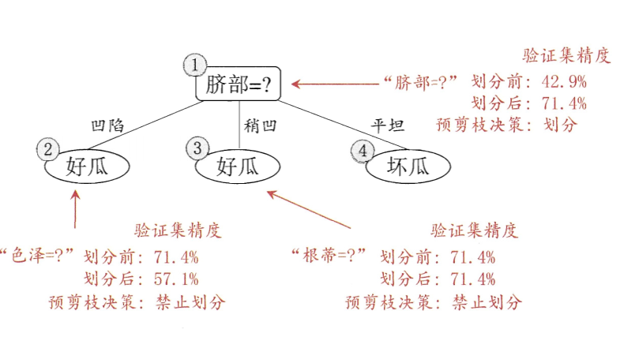
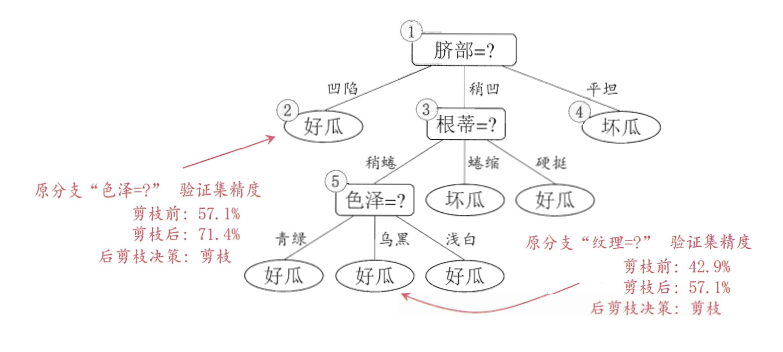
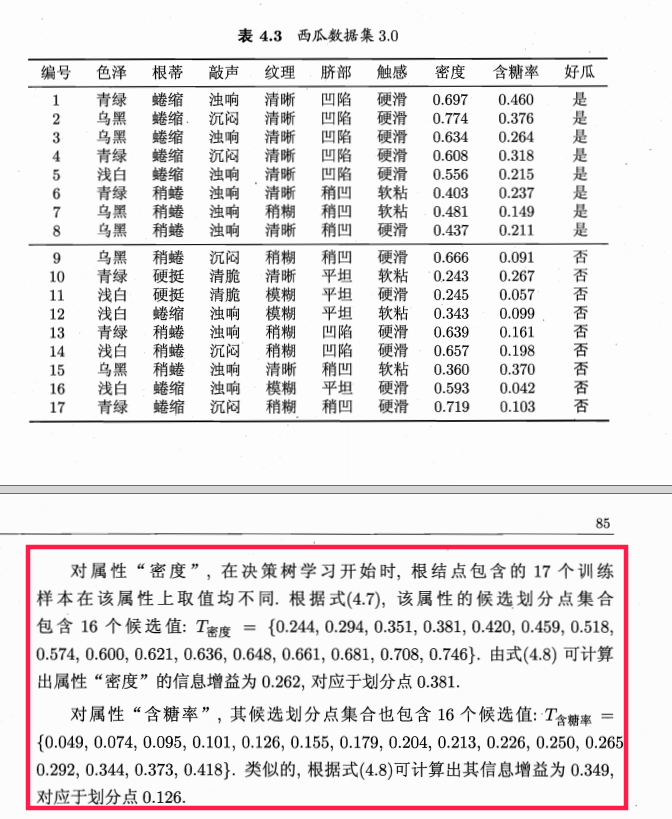
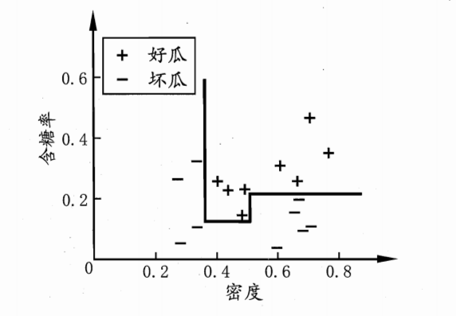
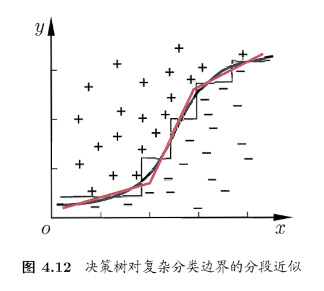
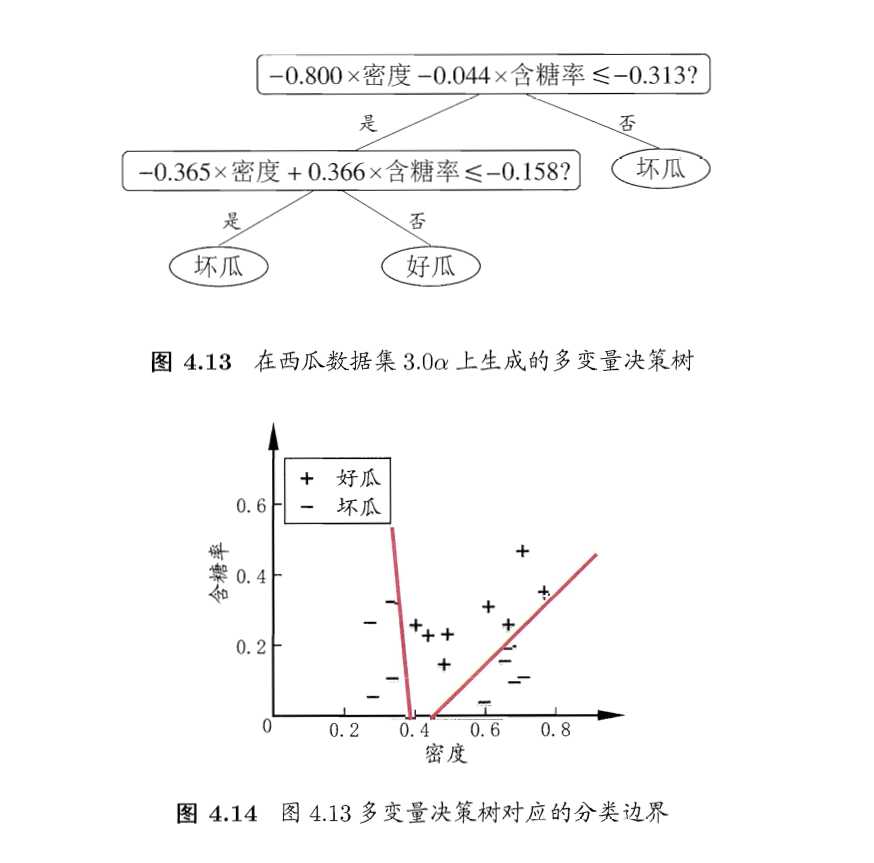

# 第4部分：决策树
##基本流程
决策树是基于树的结构进行决策，这恰似人们面对决策问题时一种很自然的处理机制。他的流程如下：
**输入**：训练集 $D=\{(x_1,y_1),(x_2,y_2),(x_m,y_m)\}$
训练集 $A=\{a_1,1-2，\cdots,a_d\}$
**过程** ：函数TreeGenerate(D,A)
_ _ _
生成node节点
if D中样本全属于同一类别C then
   &nbsp;&nbsp;将node节点标记为C类叶子节点;return
end if

if A = 空 o、OR D中样本在A上取值相同 thne
  &nbsp;&nbsp;将node节点标记为C类叶子节点,其类别标记为D中样本 最多的类;return
end if
从A中选择最优划分属性$a_*$
for $a_*$ 的每一个属性$a_*^v$ do
 &nbsp;&nbsp; 为node生成一个分支；令$D_v$表示在$a_*$上取值为$a_*^v$的样本子集
 &nbsp;&nbsp; if $D_v$ = 空 then
    &nbsp;&nbsp;将分支节点标记为叶子节点,其类别标记为D中样本 最多的类;return
    &nbsp;&nbsp; esle
	&nbsp;&nbsp;以TreeGenerate( $D_v$ ,A/{$a_*^v$})为分支节点
	&nbsp;&nbsp;end if
enf for
_ _ _
**输出**：以node为节点的决策树
显然，决策时生成是一个递归的过程。
##划分属性
决策树最关键的是如何选择最优的划分属性，一般而言我们希望随着划分过程不断的进行。决策树分支节点有包含的样本尽可能的属于同一个类别，即样本的纯度越来越高。
###信息增益
"信息熵"（information entropy）是度量样本集合纯度常用指标，假定当前样本D中地第k类样本所占的比例$p_k(k=1,2,3,\cdots,|y|)$
，则D 的信息熵定义为：
$$
Ent(D) = - \sum_{k=1}^{|y|}p_klog_2p_k
$$
Ent(D) 越小，则D 的纯度越高。
假定离散型属性a有V个可取的值$\{a^1,a^2,\cdots a^v,\}$,若使用a对样本进行划分，则会产生V个分支，其中第v个分支包含了属性a上去$a^v$的所有样本，记：$D^V$,则可计算$D^V$的信息熵；考虑到不同分支节点包含该的样本数量不同，赋予不同的权重$|D^v|/|D|$,即样本越多的分支节点影响越大，于是可计算出属性a对样本D划分获取的“信息增益”（information gain）
$$
Gain(D,a) = Ent(D) - \sum_{v=1}^{v} { |D^v| \over |D|}Ent(D^v)
$$
* 一般而言a的信息增益越大，则意味着使用属性a进行划分纯度越高，我们可以使用信息增益来进行决策树的划分.即
$a_* = argmax_{a \in A}Gain(D,a) $
###增益率
* 由于信息增益对于可取值数目较多的属性有所偏好，为减少这种偏好带来的不理影响，著名的C4.5决策算法不直接使用信息增益，而是选择增益率来最有划分属性。增益率定义为：
$$
Gain(D,a) = {Gain(D,a) \over IV(a) }
$$
其中
$$
IV(a) = - \sum_{v=1}^{v}{{|D^v|} \over {|D|}}log_2{{|D^v|} \over {|D|}}
$$
###基尼系数
CART决策树使用“基尼系数”来选取划分属性，数据集D的纯度可用基尼系数来衡量：
$$
Gini(D) = \sum_{k=1}^{|y|}\sum_{\acute{k} \neq k}p_kp_\acute{k}
$$
* 直观来讲Gini(D)反映了数据集D中随机抽取两个样本，其类别标记不一致的概率，因此Gini(D)越小，数据集D的纯度越高
$$
Gini_index(D,a) = \sum_{v=1}^v{{|D^v|} \over {|d|}}Gini(D^v)
$$
##剪枝处理
* 剪枝处理是据测试学习算法对付“过拟合”的主要手段。决策树的剪枝基本策略有“预剪枝”接“后剪枝”。
* 预剪枝是指在机器学习的过程中，对每个节点划分前先进行评估，如果当前划分节点不能带来决策树的泛华能力的提升，则停止划分并将当前节点标记为叶子节点；
* 后剪枝是先从训练集生成一棵完整的决策数树，然后自底向上对非叶子节点进行考察，若将该节点对应的子树替换为叶子节点能够带来决策树泛华能力的提升，则将该子树替换为叶子节点。

##连续与缺失值
由于连续属性的可取值数目不在有限，因此需要采用离散化技术将属性离散化，最简单的策略是二分法。
给定样本D和连续属性a假定a在D上出现了n个不同的取值，将这些值从小到大排列标记为$\{ a^1,a^2,\cdots,a^n \}$.基于划分点t可将D分为子集$D_t^-$ 和 $D_t^+$，其中 $D_t^-$ 包含属性a上取值小于t的样本， $D_t^+$ 包含属性a上取值大于t的样本。显然对于相邻属性$a^i$和$a^{i+1}$,t在区间 $[a^i,a^{i+1})$取任意值取得划分结果相同，因此对于连续属性a，我们可考察包含n-1个元素的候选点划分集合
$$
T_a = \{{{a^i+a^{i+1}} \over 2} | {1 < i <=n-1 }\}
$$
即把中位点作为候选点，然后就可以像离散属性一样进行划分、

$$
Gain(D,a) = max_{t \in T_a}Gain(D,a,t)=
max_{t \in T_a}Ent(D) - \sum_{\lambda \in \{-,+\}} { |D_t^\lambda| \over |D|}Ent(D_t^\lambda)
$$

其中Gain(D,a,t)为样本集D基于划分点的信息增益。

* 对于缺失数据情况，我们假定$\tilde{D}$表示D中属性a没有缺失的样本子集，则：
$$
a = { {\sum_{x \in \tilde D}w_x} \over {\sum_{x \in  D} w_x}}
$$
$$
Gain(D,a) = a \times Gain(\tilde D ,a)
$$
##多变量决策树
 如果把每个属性视为坐标空间的一个坐标轴。则d个属性描述样本对应了d维空间的一个数据点，对样本的分布意味着寻找不同样本之间的分类边界，决策树所形成的分类边界有一个明显的特点：轴平。即它的分类边界由若干个于坐标轴平行的分段组成。
 
此时决策树相当复杂，由于要进行大量的属性测试，预测时间开销将比较大。
若能使用斜的划分边界，则决策树模型将大为简单。”多变量决策树“能够实现这样的斜划分，在此类决策树中，非叶子节点不在是针对某个属性，而是对属性的线性组合进行测试；换言之，每个非叶子节点是一个形如 $ \sum_{i=1}^d w_ia_i =t$的线性分类器，其$w_i$ 是属性$a_i$的权重，$w_i$和t可在该节点样本集和属性集上学习得到，因此在多变量的决策树过程中，不是为每个非叶子节点寻找一个最优化分类属性，而是试图建立一个适合线性分类器。

对于西瓜我们可学习到的决策变量树如下：

