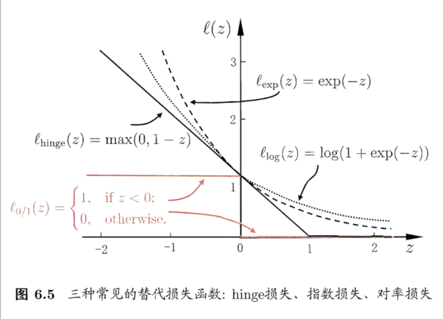

# 第6部分：支持向量机
## 6.1间隔与支持向量
* 给定训练样本集 $D = \{(x_1,y_1),(x_2,y_2),\cdots,(x_m,y_m)\},y_i \in \{-1,1\}$
分类学习的思想就是基于训练集D在样本空间找出一个超平面,将不同的类别区分开来.但是能将样本区分开来的超平面很多,如何选择最优的呢?

直观上看,应该去找位于两类样本的"正中间"的划分超平面,因为该划分超平面对训练样本局部干扰的"容忍性"最好.
划分超平面的的线性方程描述如下:
$$
w^Tx +b =0
$$
$w =(w_1,w_2,\cdots,w_d)$为空间法向量,决定了超平面的方向,b为位移项,决定了超平面距离远点的距离.
###点到平面的距离
* 平面的一般式方程
$$Ax +By +Cz + D = 0$$
其中$n = (A, B, C)$是平面的法向量，D是将平面平移到坐标原点所需距离（所以D=0时，平面过原点）
* 向量的模（长度）
给定一个向量$V（x, y, z)$,则$|V| = sqrt(x * x + y * y + z * z)$
* 向量的点积（内积）
给定两个向量$V1(x1, y1, z1)和V2(x2, y2, z2)$则他们的内积是
$$V1V2 = x1x2 + y1y2 + z1z2$$

根据以上推到知道样本空间中任意点x到超平面(w,b)的距离可表示为r
$$
r = { {|w^Tx+b|} \over {||w||}}
$$
* 其中符合|| 表示向量的模的绝对值.
假设超平面$(w,b)$能将训练样本正确分类,则对于$(x_i,y_i) \in D ,若 y_i=1,则有w^Tx_i+b>0;若 y_i=-1,则有{w^Tx_i+b}<{0}$

$$
\begin{cases} {w^Tx_i+b \geq 1} , & \text {$y_i$=+1}
\\ {w^Tx_i+b \leq -1} , & \text  {$y_i$=-1} 
\end{cases}
$$
距离超平面最近的样本点使得等号成立,他们被称为"支持向量",两个异类到超平面的距离
$$
\gamma = {2 \over ||w|| }
$$
被称为间隔.

###支持向量机的基本模型
要寻找最大间隔划分超平面,也就是要找到满足约束条件
$$
\begin{cases} {w^Tx_i+b \geq 1} , & \text {$y_i$=+1}
\\ {w^Tx_i+b \leq -1} , & \text  {$y_i$=-1} 
\end{cases}
$$
的参数w,b,使得$\gamma$最大.
$max_{\{w,b\}}{2 \over ||w|| }$
$s.t. y_i(w^Tx_i+b) \geq1,i=1,2,\cdots,m$
显然,为了最大化间隔,仅仅需要最大化 $||w||^{-1}$,这等价于最小化$||w||^{2}$,于是上的方程可重写为:

$min_{\{w,b\}}{1 \over 2  }||w||^2$
$s.t. y_i(w^Tx_i+b) \geq1,i=1,2,\cdots,m$
这就是支持向量机的基本模型.
## 6.2对偶问题
###拉格朗日对偶问题（Lagrange duality）
我们希望求解$f(x)=w^Tx+b$,其中w,b是参数.
对于$min_{\{w,b\}}{1 \over 2 }||w||^2  $使用朗格拉日乘子法可得到其"对偶问题",具体来说,对弈每条约束天剑朗格拉日乘子$\alpha_i \geq0$,则该问的他朗格朗日函数可写为:
$$
L(w,b,a) = {1 \over 2 ||w||^2} + \sum_{i=1}^m \alpha_i (1 -y_i(w^Tx_i+b))
$$
其中$\alpha = (\alpha_1,\alpha_2,\cdots,\alpha_m)$
令$L(w,b,a) w和b求偏导数为0可得$
$$
w =  \sum_{i=1}^m \alpha_ix_iy_i
$$
$$
0 =  \sum_{i=1}^m \alpha_iy_i
$$
于是等到对偶问题:
$$
max_{\alpha}\sum_{i=1}^m \alpha_i- {1 \over 2}\sum_{i=1}^m\sum_{j=1}^m \alpha_i\alpha_jy_iy_jx_i^Tx_j
$$
$$
s.t 0 =  \sum_{i=1}^m \alpha_iy_i
$$
$$
 \alpha_i \geq 0,i=1,2,\cdots,m
$$
解出$\alpha$后,求出w,b即可得到模型.
$$
f(x)=w^Tx+b=\sum_{j=1}^m \alpha_iy_ix_i^Tx_i+b
$$
解出的$\alpha_i $是朗格拉日乘子,它敲好对应着训练样本$(x_i,y_i)$,因此上述过程满足kkt条件.
$$
\begin{cases} \alpha_i \geq0
\\ y_if(x_i)-1 \geq0
\\\alpha_i(y_if(x_i)-1) =0
\end{cases}
$$
对于任意样本$(x_i,y_i)$总有$\alpha_i=0$或者$(y_if(x_i)-1)=0$,如果$\alpha_i=0$则样本不会对模型有任何影响;如果$\alpha_i=\geq 0$,则必有$y_if(x_i)=1$,所对应的样本点位于最大间隔边界上,是一个支持向量,这显示出来一个重要性质:训练完成后,大部分样本不需要保留,最终模型和支持向量有关.
###朗格拉日原始问题
https://blog.csdn.net/xierhacker/article/details/72673207
## 6.3核函数
一般我们假设训练样本是线性可分的,但是在现实中,原始样本空间也许并不存在一个正确划分样本的超平面.比如"异或"问题就不可分.

这样的问题可将样本从原始空间映射到一个跟高维的特征空间,使得样本在这个特征空间内线性可分.如上图将二维映射到三维,就能找到一个合适的划分超平面.如果原始空间是有限维度,即属性有限,则一定存在一个高维特征空间使得样本可分.
* 令 $\varphi(x)$表示将$x$映射后的特种向量,于是特种空间划分超平面对应的模型为:
$$
f(x)=w^T \varphi(x)+b
$$
其中w和b是模型参数,有:
$$min_{\{w,b\}}{1 \over 2 }||w||^2$$
$$
s.t. y_i(w^T\varphi(x_i)+b) \geq 1),i=1,2,\cdots,m
$$
其对偶问题是:
$$
max_{\alpha}\sum_{i=1}^m\alpha_i - {1 \over 2}\sum_{i=1}^m\sum_{j=1}^m\alpha_i\alpha_jy_iy_j\varphi(x_i)^T\varphi(x_j)
$$
$$
s.t 0 =  \sum_{i=1}^m \alpha_iy_i
$$
$$
 \alpha_i \geq 0,i=1,2,\cdots,m
$$
求解后得到:
$$
f(x)=w^T\varphi(x)+b=\sum_{j=1}^m \alpha_iy_i\varphi(x_i)^T\varphi(x)+b=
\sum_{j=1}^m \alpha_iy_ik(x,x_1)+b
$$
这里的函数$k(.,.)$称为"核函数"
显然,如果已知映射$\varphi(.,.)$的形式,则可写出$k(.,.)$,但现实中我们通常不知道$\varphi(.,.)$,那么合适的核函数是否存在呢?什么样的函数可做核函数?

* 常用核函数:

* 线性核
  $k(x_i,x_j)=x_i^Tx_j$ 
* 多项式核 
  $k(x_i,x_j)=(x_i^Tx_j)^T$ ; $d\geq1$为多项式次数 
*  高斯核 
$k(x_i,x_j)=\exp(-{{||x_i-x_j||^2} \over {2 \varsigma^2}})$ ;$\varsigma^>0$ 为高斯带宽
 *  莱普拉斯核 
$k(x_i,x_j)=\exp(-{{||x_i-x_j||} \over {\varsigma}})$ ;$\varsigma^>0 $为高斯带宽
* Sigmoid核
$k(x_i,x_j)= tanh( {\rho}x_i^Tx_i+\vartheta )$;tanh为双曲函数
* 此外如果$k_1,k_2$为核函数,则器线性组合,直积为核函数.
* 对于任意函数$g(x)$;则$k(x,z)=g(x)k_1(x,z)g(z)$为核函数.
## 6.4 软间隔和正则化
前面介绍的支持向量机要求所有样本都满足条件，即所欲样本的都划分正确，这个称为“硬间隔”，而“软间隔”则是允许某些样本不满足约束。

$$
y_i(w^Tx_i+b) \geq1
$$

* 该问题变成在最大化间隔的同时，不满足约束条件的样本尽可能的少，于是优化目标可写成：
$$
min_{w,b}{1 \over 2}||w||^2 + C\sum_{i=1}^{m} l_{0/1}(y_i(w^Tx_i+b)-1)
$$
其中$C>0$是一个常数，$ l_{0/1}$为“0/1”损失函数。
$$
l_{0/1}(z) = 
\begin{cases}
1,  & \text{if $z$ <0 }
\\0, & \text{otherwise}
\end{cases}
$$
* 显然当C为无穷大时，迫使所有样本满足约束条件，于是优化目标等价于
$$min_{\{w,b\}}{1 \over 2  }||w||^2$$
$$s.t. y_i(w^Tx_i+b) \geq1,i=1,2,\cdots,m$$
* 当C取值有限是，允许一些样本不满足约束。
* 然而，$ l_{0/1}$为非凸非连续，数学性质不好，于是通常使用其他函数来代替$ l_{0/1}$，称为“替代损失”，替代损失通常通常具有较好的数学性质，比如他们经常是凸函数且连续：
hinge损失：$l(z)=max(0,1-z)$
指数损失：$l(z)=exp(-z)$
对率损失：$l(z)=log(1+exp(-z))$
如果采样hinge损失函数，则优化目标可写成：
$$
min_{w,b}{1 \over 2}||w||^2 + C\sum_{i=1}^{m} {max(0,(1-y_i(w^Tx_i+b)))}
$$

引入松弛变量$\xi_i >0$ 则上式可重写为：
$$
min_{w,b}{1 \over 2}||w||^2 + C\sum_{i=1}^{m} \xi_i
$$
$$
s.t: y_i(w^Tx_i+b) \geq 1-\xi_i
$$
$$
\xi_i \geq 0 ,i=1,2,3,\cdots,m
$$
这就是软间隔支持向量机。

## 6.5 支持向量回归
对样本（x,y），传统回归模型直接基于模型输出值和真实值y计算随时函数，当且仅当f(x)和y完全相同时损失才为0；于此不同，支持向量回归假设我们能够容忍f(x)和y之间有$\varepsilon$偏差，这相当于在以f(x)为中心,构建一个宽度为$2\varepsilon$的间隔带，如果训练样本落入此间隔带，则被认为是正确的。

于是SVR问题可形式化为：
$$
min_{w,b}{1 \over 2}||w||^2+C \sum_{i=1}^{m}l_{\varepsilon}(f(x-i)-y_i)
$$
其中C为正则化常数，$l_{\varepsilon}$为$\varepsilon$不敏感函数，
$$
l_{\varepsilon}(z) = \begin{cases}
0;if|z|<\varepsilon
\\|z|-\varepsilon ; otherwise
\end{cases}
$$
引入松弛变量$\xi_i;\hat\xi_i$,则SVR可重写为：
$$
min_{w,b,\xi_i;\hat\xi_i}{1 \over 2}||w||^2+C \sum_{i=1}^{m}(\xi_i+\hat\xi_i)
$$

