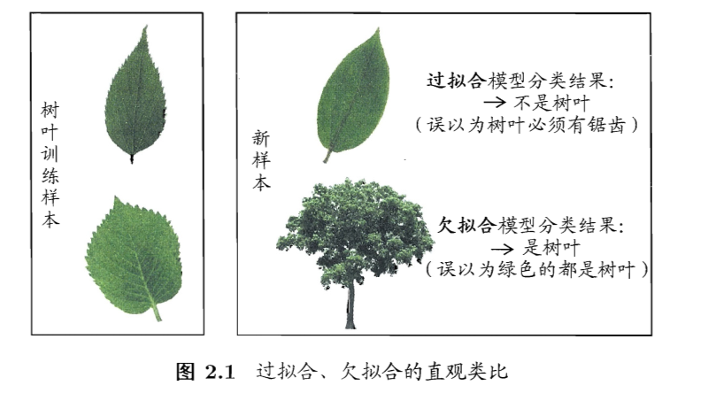
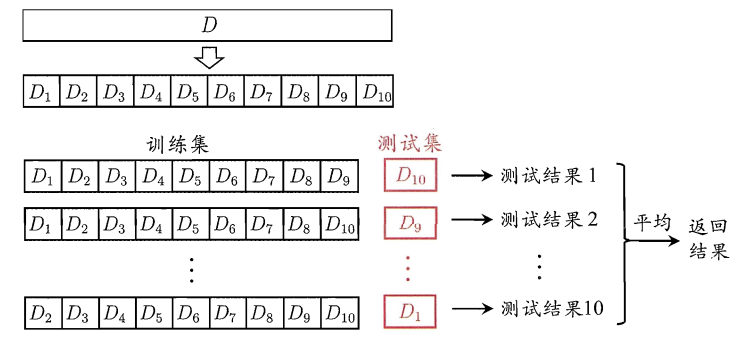
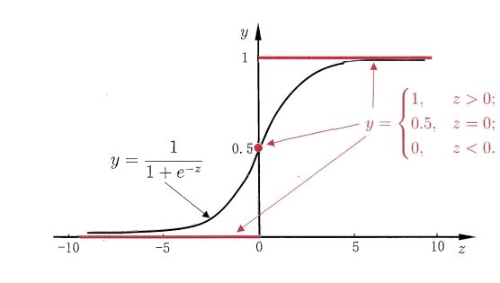
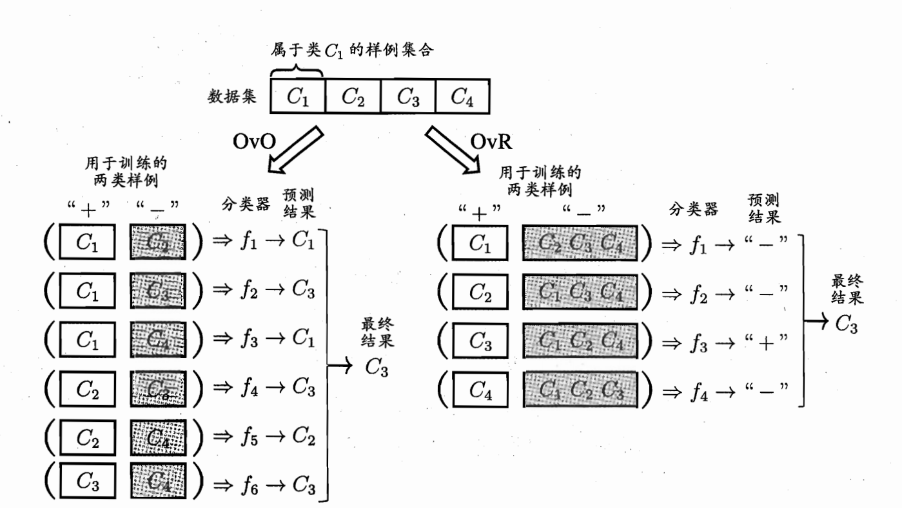
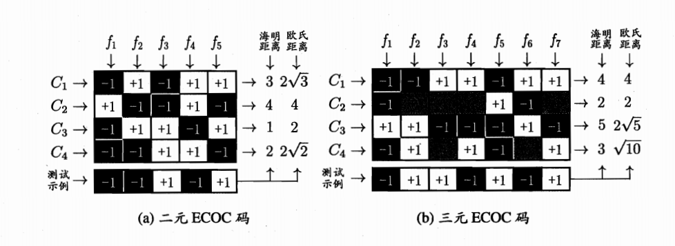

# 第1部分：数学基础
## 1. 矩阵
## 2. 优化
## 3. 概率分布

# 第2部分：模型评估与选择
## 2.1 经验误差与过拟合
### 1. 过拟合：
* 机器学习把训练样本学习的“太好了”，很可能把训练样本自身的一些特点（噪声）当做潜在样本都具有的一般性质，这样会导致泛化能力的降低，这中现象称之为过拟合（overfitting）。
### 2. 欠拟合：
* 与过拟合对应的为欠拟合，是值训练样本的一般性质并未学好

## 2.2 误差评估方法
### 1：留出法
* 将数据集D划分两个互斥的集合，其中一个作为训练集S,另一个作为测试集T,即： $ D = S \bigcup B $,$ S \bigcap B =  \emptyset$,在训练集S上训练好模型后，在测试集T上进行测试，作为泛化误差的估计。
### 2：交叉验证法
* 交叉验证法将数据集D划分为K 个大小相等的互斥子集，即：$ D = D_1 \bigcup D_2 \bigcup D_3 \cdots D_K $,每个子集$D_k$ 尽可能保持数据分布的一致性，即从D中通过分层采样的到。每次用k-1 个子集作为训练集，剩下的地k个集合作为测试集；这样可以获得k组 {训练集、测试集}，从而可进行k次训练和测试，最终返回这k次训练结果的均值。
* 留一法每次随机取值相对比较准确，但是对于上亿数据计算机开销太大。

### 3：自助法
* 自助法（bootsrap）是同时兼容性能和一致性的方案，它以自助采样（bootstrap sampling）为基础，给定包含m个样本的数据集D，我们对它进行采样生成数据 $D^，$：每次随机从D中挑选出1个样本，将其copy到$D^，$，然后再将该样本放回D中，使得下次在采样的的时候任然能够被采样的到；这样重复m次后我们就得到包含m个样本的数据集$D^，$。显然D中部分样本会在$D^，$中多次出现，而另外一部分样本不出现，。可以做简单估计，样本在m次采集中始终不被采集的概率为 $（1- {1\over m}）^m $,取得极限得到：$\lim_{n \to +\infty} （1- {1\over m}）^m \rightarrow {1 \over e} \approx 0.368 $
* 即通过采样，初始数据集D中有36.8 的样本未出现在 $D^,$中，于是将$D^,$ 作为训练集，D - $D^,$ 作为测试集。
*  自助法产生的数据集改变了初始数据分布，引入了估计偏差，因此在初始数据足够的时候，留出法比较常用。
## 2.3 模型度量
### 1：均分误差
* 在预测中给定数据集$D = { (x_1,y_1),(x_2,y_2),... (x_m,y_m)}$ ,其中$ y_i$ 是$ x_i$ 的真是标记数据，要评估学习器f，需要对机器学习预测结果f(x) 和真实标记y比较：
* 回归任务常用的“均方误差”（mean squared error）:
$$ E(f;D)={1 \over m } \sum_{i=1}^{m} ( f(x_1) - y_i)^2$$
* 对于数据分布D和概率密度函数p（.）,均方误差可描述为
$$ E(f;D)=\int_{x \in D}  ( f(x_1) - y_i)^2 P(x) d(x)$$
### 2：错误率正确率
错误率计算公式：
$$ E(f;D)={1 \over m } \sum_{i=1}^{m} \prod ( f(x_1) \neq y_i)$$
正确率计算公式：
$$ acc(f;D)={1 \over m } \sum_{i=1}^{m} \prod ( f(x_1) = y_i) P(x) d(x)= 1 -  E(f;D)$$

* 对于数据分布D和概率密度函数p（.）,错误率和正确率：
$$ E(f;D)= \int_{x \in D} \prod ( f(x_1) \neq y_i)P(x) d(x)$$
正确率计算公式：
$$ acc(f;D)=\int_{x \in D} \prod ( f(x_1) = y_i)P(x) d(x)= 1 -  E(f;D)$$

# 第3部分：线性模型
## 3.1基本形式
给定由d 个属性描述的示例 $ x = (x_1,x_2,\cdots,x_d)$其中$x_i$是x在第i个属性上的取值，线性模型通过线性组合来进行预测函数，即：
$$
f(x) = w_1x_1 + w_2x_2 + \cdots + w_dx_d +b
$$
* 向量的表示
$$
f(x) = w^Tx + b
$$
其中 $ w = (w_1,w_2,\cdots,w_d)$.
由于线性模型表达了各个属性值在预测模型上的重要性，因此有很好的解释性。例如 $ f(x) = 0.2*x_1+0.8*x_2 + b$,从而让模型更能解释现实问题。
## 3.2 线性回归
* 给定数据集 $D = {(x_1,y_1),(x_2,y_2),\cdots (x_n,y_n)} ,y_i \in R.$ 线性模型试图学习一个线性模型尽可能的预测实际值。
* 对于离散的属性，如果属性之间存在“序”（order）关系，可通过连续化将其转换为连续值，example：身高：{高,中，低} 转为{1,0.5.0}；如果属性不存在有序关系，通常将其转化为k维向量。example：{西瓜，南瓜，黄瓜}转为（0,0,1）,（0,1,0）,（1,0,0）
* 线性模型试图学得
$$
f(x_i) = wx_i + b , 使得 f(x_1) \approx y_i
$$
我们可以通过均方差最小化来求得w 和b
$$
(w^*,b^*) =  arg min_{（w,b）} \sum_{i=1}^{m}( y_i - f(x_i))^2 = arg min_{（w,b）} \sum_{i=1}^{m}(y_i - wx_i - b )^2
$$
基于均方误差最小化进行模型求解的过程为“最小二乘法”，求解w,b 使得 $ E(w,b) = \sum_{i=1}^{m}(y_i-wx_i-b))^2$最小化的过程称为线性回归的最小二乘参数估计，将E(w,b)，分别对w和b求导：
$$
\frac{\partial E(w,b)}{\partial w} =2(w\sum_{i=1}^m x^2 -\sum_{i=1}^m (y-1 -b)x_i)
$$

$$
\frac{\partial E(w,b)}{\partial b} =2(mb-\sum_{i=1}^m (y_i -wx_i)
$$
令偏导数为0可解的w,b 的最有封闭解：

$$
w = \frac{\sum_{i=1}^m (y_i(x_i-\overline{x}))}{\sum_{i=1}^m x^2 - \frac{1}{m}(\sum_{x=1}^m x_i)^2}
$$
$$
b = \frac{1}{m}\sum_{x=1}^m(y_i - wx_i)
$$
其中
$$
\overline x = {1 \over m} \sum_{i=1}^mx_i
$$

矩阵表示形式：
$$
f(x_i) = w^Tx_i+ b ； 使得 f(x_i) \approx yi
$$
把w 和b 收入向量形式 $ \hat{w} = (w;b) $
设数据集D表示 $m  \times (d+1)$ 的矩阵$X$
$$
     X =   \begin{pmatrix}
         a_{11} & a_{12} & \cdots & a_{1d} & 1 \\
     a_{21} & a_{22} & \cdots & a_{2d} & 1 \\
        \vdots & \vdots & \vdots & \ddots & \vdots \\
          a_{m1} & a_{m2} & \cdots & a_{md} & 1 \\
        \end{pmatrix}
		=
		 \begin{pmatrix}
		  x_1^T & 1 \\
		  x_2^T & 1 \\
		  \vdots & \vdots \\
		  x_m^T & 1 \\
		\end{pmatrix}
$$

$$
y = (y_1;y_2 ;\cdots;y_n)
$$
则最小二乘法的向量表示形式为：
$$
\hat{w^*} = argmin_{w^*} (y -X\hat{w})^T (y -X\hat{w})
$$
令 $ E_{ \hat{w}} = (y -X\hat{w})^T (y -X\hat{w}) $
对$\hat{w}$求导：

$$
\frac{\partial E_\hat{w}}{\partial \hat{w}} =2 X^T(X\hat{w}-y)
$$
令上式为0可解得$\hat{w}$最优解(注意矩阵需要是满秩矩阵)
$$
\hat{w^*} = (XX^T)^{-1}X^Ty
$$
## 3.2 对数几率回归
对于二分类问题，其输出的标记 $ y \in {(0,1)}$,而线性模型产生的预测值$z = w^Tx+b$是实数，于是需要将z转换为（0,1）值，一般采用单调可微的函数sigmoid处理。
$$y = { 1 \over {1+e^{-z}}}$$

sigmoid函数将z转为为一个接近0或者1的y值，并且在z=0附近变化陡峭，将预测函数带入得到：
$$
y = {1 \over {1+e^{-(w^Tx+b)}}}
$$
如果将y看做样本x作为正例的可能性，则1-y表示反例可能性，两者的比值称为“几率”，反映了x作为正例的可能性，对几率取对数得到“对数几率”。
$$
\ln{y \over {1-y}} = w^Tx+b
$$
对数几率对分类可能性进行建模，无需实现假设数据的分布，这样避免了假设不准确带来的问题，他不仅仅能预测出类别，而且能够得到近似概率预测，对很对概率辅助决策很有用；此外对数函数是任意阶可导，有和好的数学性质。
* 求解w和b的过程如下，若将y视为后验概率估计 p(y=1|x),则：
$$
ln{{p(y=1 |x)} \over{p(y=0|x)}} = w^Tx+b
$$
显然有 ：
$$
p(y=1|x) ={ e^{w^Tx+b}\over {1+ e^{w^Tx+b} }}
$$
$$
p(y=0|x) ={ 1\over {1+ e^{w^Tx+b} }}
$$
可用最大似然法求w和b
## 3.3 线性判别分析
线性判别分析（Linear Discriminat Analysis简称LDA）思想很朴素，他设法将样例投影到一天直线上，使得同类投影点尽可能相近，异类样本点尽可能原理，在对新样本进行分类是，将其投影到直线上，在根据样本点的位置来 确定样本类别。

给定数据集$D ={\{(x_i,y_i)\}}_{i=1}^m,y_i \in\{0,1\},令X_i,u_i \sum_i$分别表示示例 $i \in \{0,1\}$的集合、均值向量、和协方差矩阵.若数据投影到直线$w$上,则两类样本的中心在直线上的投影分别为$w^Tu_0 和 w^Tu_1$；如果将所有样本点都投影到直线上，则两类样本的协方差矩阵为$w^T\sum_0w和w^T\sum_1w$
想要同类样本尽可能的近，可以让同类样本协方差尽可能小，即$w^T\sum_0w+w^T\sum_1w$尽可能小，而想要异类样本尽可能大，可以让异类之间的距离尽可能大 即$ ||w^Tu_0 - w^Tu_1||_2^2$尽可能大，同时考虑二者，可得到最大化的目标：
$$
J = {{||w^Tu_0 - w^Tu_1||_2^2} \over {w^T\sum_0w+w^T\sum_1w}} ={{w^T(u_0-u_1)(u_0-u_1)^Tw} \over {w^T(\sum _0+\sum_1)w}}
$$
此函数可用l拉格拉日余子式求接。
## 3.4 多分类学习
多分类主要是多二分类的拆分，经典拆分有“一对一”，“一对多余”，“多对多”
给定数据集$D=\{(x_1,y_1),(x_2,y_2) \cdots (x_m,y_m)\},y_i \in \{c_1,c_2,\cdots ,c_n\}$
### 一对一：
将N个类别分别两两配对，从而产生n(n-2)/2 个分类任务，在测试阶段新的样本提交给所有分类器，最终通过投票把预测最多的类别作为分类类别。
### 一对其他：
每次将1 个作为正例，其他的作为反例.若测试的时候只有1个为正例则对于的类别标记为正例，若有多个为正例则考虑各个分类的置信度，选择置信度最大的为分类结果。

### 多对多
编码：对n个分类做m从划分，每次将一部分划分为正类，一部分划分为反类，从而形成二分类训练集合；这样有m个训练结合和对应的m个分类器
解码：m个分类器分布多测试集合进行测试，这样的预测标记组成一个编码，将这个预测编码和每个类别的各自编码做比较，返回其中（欧式）距离最小的作为最终预测结果。

