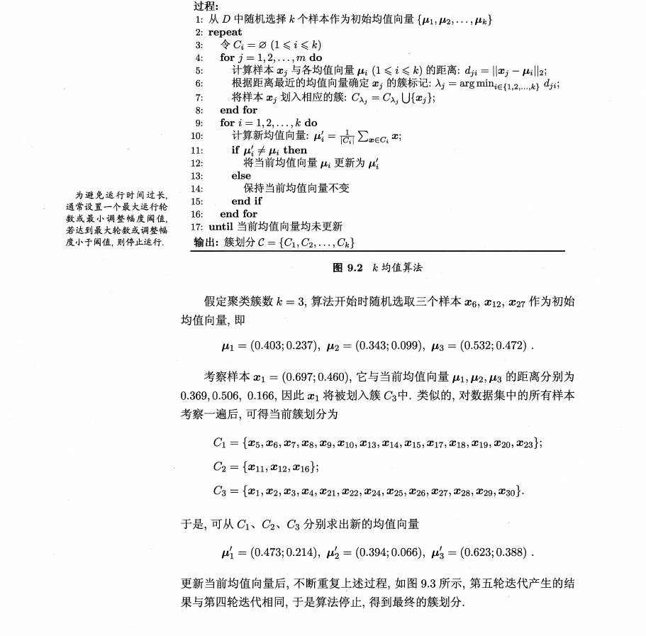
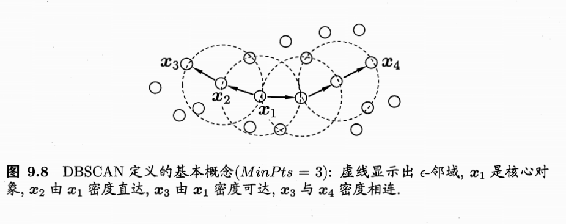
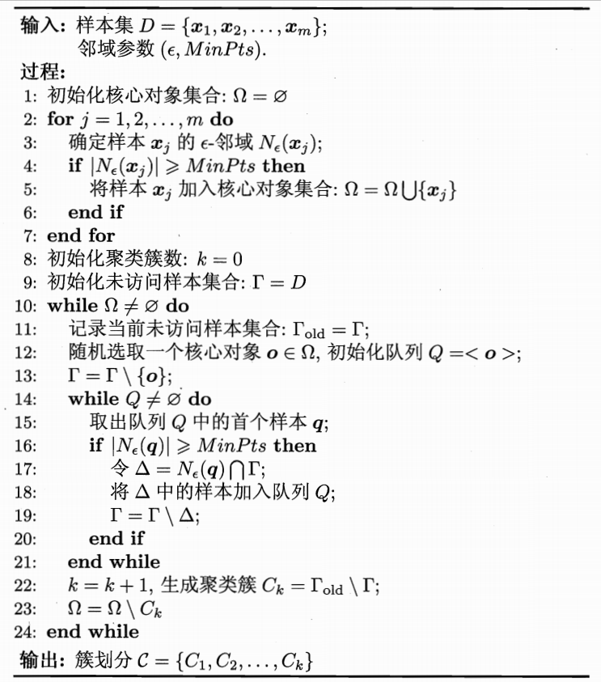
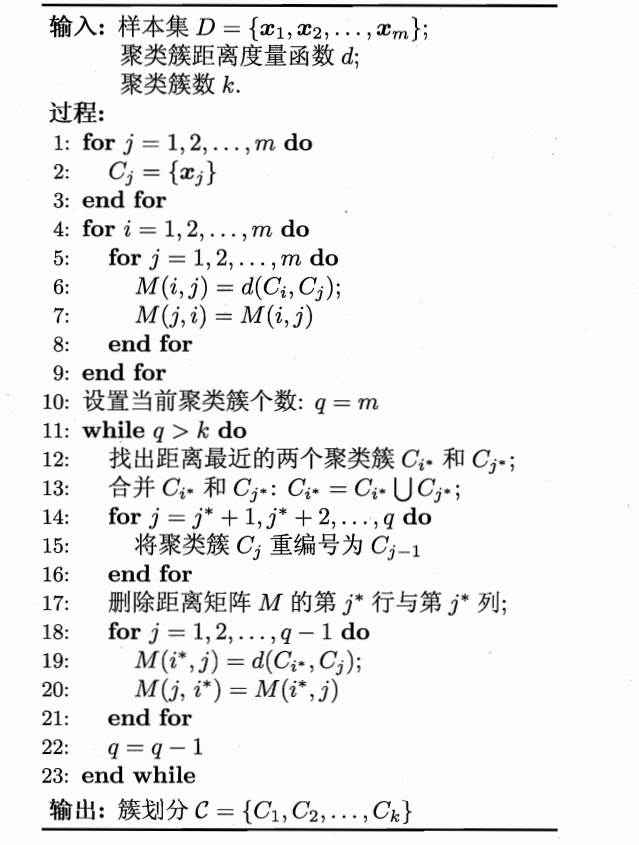
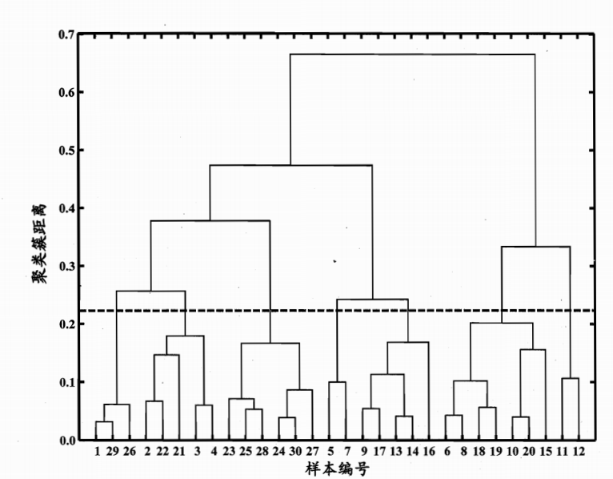

# 第9部分：聚类
##k均值算法
给定样本集$D=\{x_1,x_2,\cdots ,x_m\}$，k均值算法针对聚类所的的族划分$C=\{C_1,C_2,\cdots ,C_k\}$最小化平均误差。
$$
E = \sum_{i=1}^k\sum_{x \in C_i}|| x-u_i||_2^2
$$
其中$u_i = {1 \over {|C_i|}} \sum_{x \in C_i}x$是族$c_i$的均值向量。直观来看他在一定程度上刻画了族内样本向量的紧密程度，E越小，则紧密程度越高。
需要找到他的最优需要考察样本集D的所有可能的族划分，这是一个NP难问题，因此k均值算法采样贪心策略，通过迭代优化求近似接。

##学习向量量化
“学习量量化（Learning Vector Quantization）”,简称LVQ,试图寻找一种原型向量来刻画聚类结构，与一般聚类算法不同的是，LVQ假设样本带有类别标记，学习过程中利用样本的监督信息来辅助聚类。
给定样本集合$D=\{(x_1,y_1),(x_2,y_2), \cdots (x_m,y_m)\}$,每个样本$x_j$是有n个属性描述的特征向量$(x_{j1};x_{j2}; \cdots x_{jn}),y_i \in y是样x_j的类别标记$,LVQ的目标是学习一组n维属性两样$\{p_1,p2, \cdots ,p_q\}$,每个原型向量代表一个聚类族，族标记 $t_i \in y$.
* * *
输入：样本集 $D=\{(x_1,y_1),(x_2,y_2), \cdots (x_m,y_m)\}$;原型向量个数q;各个原型向量预设类别标记$\{t_1,t_2,\cdots t_q\}$;学习率$ \eta \in (0,1)$ 
过程：
初始化一组原型向量$\{p_1,p2, \cdots ,p_q\}$
repeat
&nbsp; &nbsp;从样本集合集$D$中随机选取样本$(x_i,y_i)$
&nbsp; &nbsp;计算样本$x_i 和 p_i(1 \leq i \leq q)的距离:d_{ij}=||x_i - p_i||_2$
&nbsp; &nbsp;if $y_i = t_{i*}$ then
  &nbsp; &nbsp;&nbsp; &nbsp;$\acute p = p_{i*} + \eta.(x_i - p_{i*}) $
&nbsp; &nbsp;else
&nbsp; &nbsp;&nbsp; &nbsp;$\acute p = p_{i*} - \eta.(x_i - p_{i*}) $
&nbsp; &nbsp;end if
&nbsp; &nbsp;将原型$p_{i*} 更新为 \acute p$
untile 满足停止条件（达到最迭代次数或者向量更新更小）
输出：原型向量$\{p_1,p2, \cdots ,p_q\}$
* * * *
算法先对向量初始化，例如对第q个族可从类别标记$t_q$中随机选取一个作为原型向量，然后对原型向量进行迭代；没一轮迭代中。算法随机选取一个有标记的样本，找出与其距离最近的原型向量，并根据两者的类别标记是否一致来对原型进行更新，如果算法满足条件（达到最迭代次数或者向量更新更小）则返回原型向量作为最终结果。
显然LVQ最关键的如何更新原型向量，直观上来看对样本$x_j$如果最近的原型向量$p_{i*}$与$x_j$类别标记相同，则令$p_{i*}$向$x_j$方向靠拢，反之则远离。
$$
\acute p = p_{i*} + \eta.(x_i - p_{i*}) 
$$
$\acute p和 x_j$之间的距离定义为：
$$
d_{ij}=||x_i - p_i||_2 = || p_{i*} + \eta.(x_i - p_{i*}) - x_j ||_2 = (1- \eta).||p_{i*} -x_j||_2
$$
学习率 $ \eta \in (0,1)$.
在学习到一组向量原型$\{p_1,p_2 
\cdots p_q\}$后则可实现对x的族划分，对于任意样本x，他将被划分到与其距离最近的样本族中；换言直，每个原型向量$p_i$定义了一个与之相关的区域$R_i$,该区域中每个样本和$p_i$的距离不大于和其他原型向量$P_{ \acute i}( \acute {i} \neq i)$的距离。 
##密度聚类
密度聚类算法假设聚类结构能够通过样本分布的紧密程度来确定。通常情况下，密度算法从样本的密度角度来考虑样本之间的可连续性，并基于可连续性不断扩展聚类族以获得最终的聚类结果。
DBSCAN是一种著名的聚类算法，他基于“邻域”，参数来刻画样本分布的紧密程度。
* $\epsilon$表示邻域
* 密度直达
* 密度可达
* 密度相连

基于以上概念将“族”定位为：有密度可达关系导出的最大密度相连的集合。形式化的说，给定邻域参数$ (\epsilon ,MinPts),族 C \in D$是满足一下性质的非空样本子集：
* 链接性（connectivity）:$x_i \in C,x_j  \in C \implies x_i 和x_j相连$
* 最大性（maximality）：$x_i \in C,x_j 由x_i密度可达 \implies x_j \in c$
那么如何从数据集D中找出满足以上性质的聚类族呢？DBSCAN算法先任选其中一个核心对象为“种子”，再由次出发确定相邻的聚类族，找出由其密度可达样本生成的聚类族，知道所有核心对象被访问过为止。

### 层次聚类
层次聚类试图在不同的层次上对数据集进行划分，从而形成树形的聚类结构，数据集的划分可采用“自底向上”的聚合策略，和“自顶向下”的拆分策略。
AGNES是一种采用自底向上的聚合策略的层次聚类算法，它先将数据集中的每个样本看做一个初始的聚类族，然后在算运行的每一步找出距离最近的两个族合并，该过程不断重复，直到达到预设族个数，这里关键是如何计算聚类族之间的距离，实际上每个族是一个样本集合，因此只需要采用关于集合的距离即可，给定族$C_i,C_j$:
* 最小距离：$d_{min}(C_i,C_j) = min_{x \in c_i;z \in c_j} dist(x,z)$.
* 最大距离：$d_{max}(C_i,C_j) = max_{x \in c_i;z \in c_j} dist(x,z)$.
*  平均距离：$d_{avg}(C_i,C_j) = { 1 \over { |C_i||C_j|}} \sum_{x \in c_i} \sum_{z \in c_j} dist(x,z)$.
显然最小距离是有两个族最近样本决定；最大距离是由两个族最远样本决定，平均距离是由两个族的所有样本共同决定。
当采样最小距离计算时算法被称为“单链接”
当采样最大距离计算时算法被称为“全链接”
当采样平均距离计算时算法被称为“均链接”

