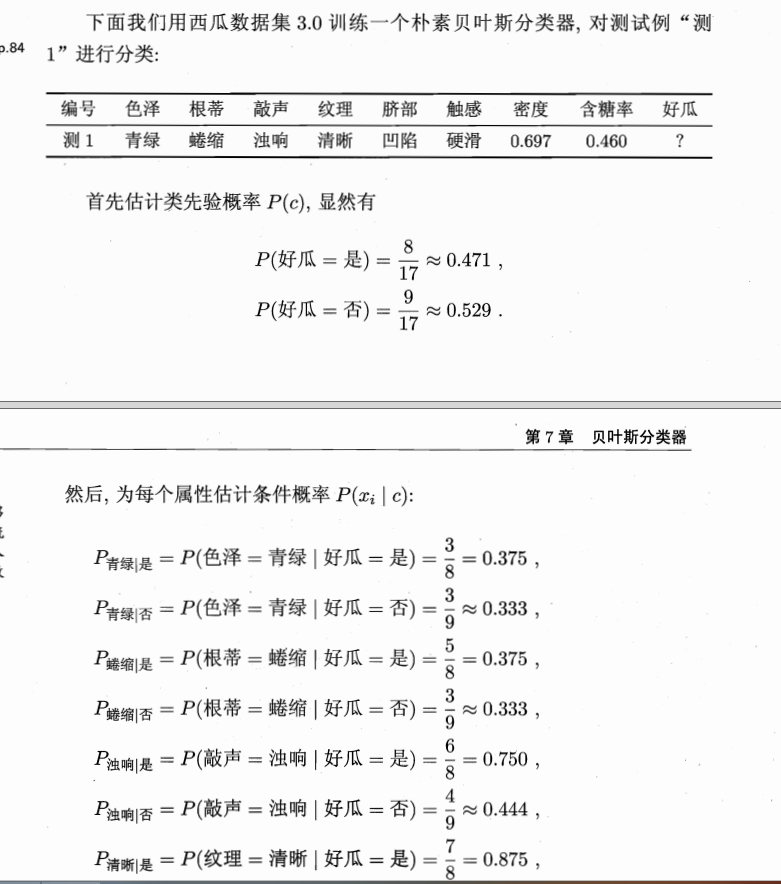
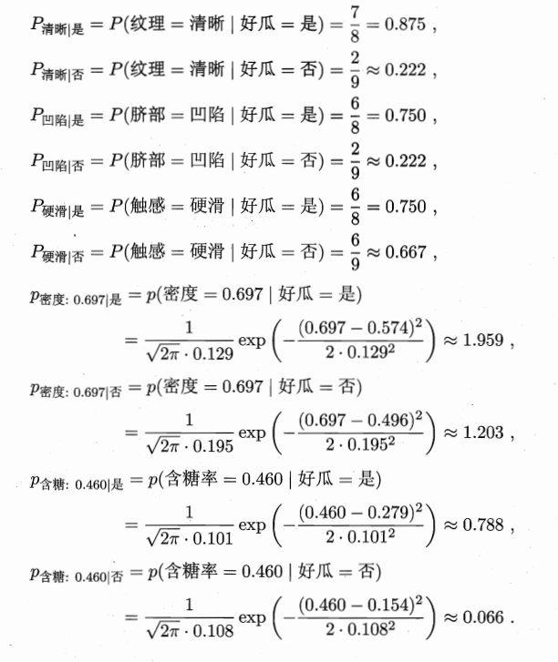
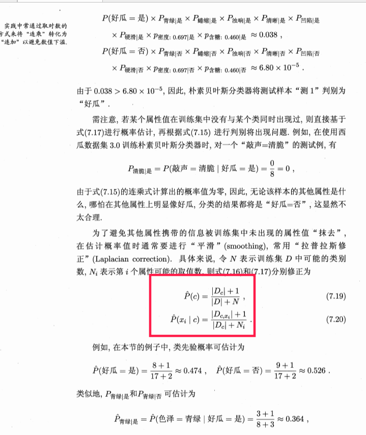

# 第7部分：贝叶斯分类
## 贝叶斯决策理论
$$
p(c|x) = {{p(c)p(x|c)} \over {p(x)}}
$$
其中，$p(c)$是先验概率；$p(x|c)$是样本x相对于标记c的条件概率，或者称为似然。$p(x)$是归一化因子。对于给定样本x。其归一化因子p(x)和类标记无关，,因此估计$p(c|x)$的问题转化为基于训练集合D估计先验概率$p(c)$和似然$p(x|c)$
* 先验概率$p(c)$表达了样本空间中各类所占比例，根据大数定理，当训练集包含充足独立分布样本是，$p(c)$可以通过样本出现的频率来估计。
* 对于条件概率$p(x|c)$来说，由于他涉及关于x所有属性的联合概率，直接根据样本出现频率会有困难，因为可能有些属性未出现在样本中，因此引入极大似然估计。
## 极大似然估计
关于类别c的类条件概率为$p(x|c)$来，假定$p(x|c)$来具有明确的形式并被参数向量$\theta_c$唯一确定，则我们的任务就是利用训练集D估计参数$\theta_c$，为了明确起见，我们将$p(x|c)$记为：$p(x|\theta_c)$。
* 令$D_c$表示训练结合D中c类样本组成的集合，假设这些样本是独立分布的，则参数$\theta_c$对数据集$D_c$的似然是：
$$
P(D_C | \theta_c)=\prod_{x \in D_C}P(x |\theta_c)
$$
对$\theta_c$进行极大似然估计，就是寻找最大化$P(D_C | \theta_c)$的参数$\hat{\theta_c}$，直观来看极大似然估计是试图在$\theta_c$中找到所有可能的取值，使得数据出现的可能性最大。
* 上面的式子中连成容易造成下溢，通常使用对数似然（log-likelihodd）：
$$
LL( \theta_c)=\log P(x |\theta_c) = \sum_{x \in D_c} \log P(x|\theta_c)
$$
此时$\theta_c$的极大似然估计$\hat \theta_c$为：
$$
\hat {\theta_c} = argmax_{\theta_c}LL( \theta_c)
$$
## 朴素贝叶斯分类
基于贝叶斯公式来估计后验概率p(c|x)主要困难在于类条件概率p(x|c)是所有属性上的联合概率分布，难从有限的训练样本中直接估计得出。
为了避开上述障碍，朴素贝叶斯采用“属性条件独立假设”：对已知类别，假设所有属性相互独立，即假设妹儿属性独立的对分类结果产生影响。
基于属性条件独立假设，贝叶斯公式可重写：
$$
p(c|x) = {{p(c)p(x|c)} \over {p(x)}}={{p(c)} \over {p(x)}}\prod_{x=1}^dP(x_i |c)
$$
其中d为属性数目，$x_i为x$在第i个属性上的取值。
由于对所有类别来说p(x)相同，因此有以下贝叶斯判断准则。
$$
h_{nb}(x)=argmax_{c \in y}P(c)\prod_{x=1}^dP(x_i |c)
$$
这就是朴素贝叶斯分类器表达式。
*  显然朴素贝叶斯是基于训练集D来估计先验概率p(c);并为每个属性估计条件概率$p(x_i|c)$
*  令$D_c$表示训练集合D中c类样本组成的结合，如果有充足的独立样本，则：
$$
p(c)={{|D_c|} \over {|D|}}
$$
*  对离散属性而言，令$D_{cx_i}$ 表示$D_c$在第i个属性上取值为$x_i$的样本组成的集合，则：
$$
p( x_i|c)={{|D_{cx_i}|} \over {|D_c|}}
$$
*  对连续属性可考虑概密度函数，假定$p(x_i|c) 服从 N(\mu_{c,i},\sigma_{c,i}^2)$其中$\mu_{c,i}$和$\sigma_{c,i}^2$分布是c类在第i个属性的均值和方差：
$$
p(x_i|c)={1 \over{\sqrt{2\pi}}\mu_{c,i}} exp(-{({x_i-\mu_{c,i})^2}  \over {2 \sigma_{c,i}}^2})
$$

