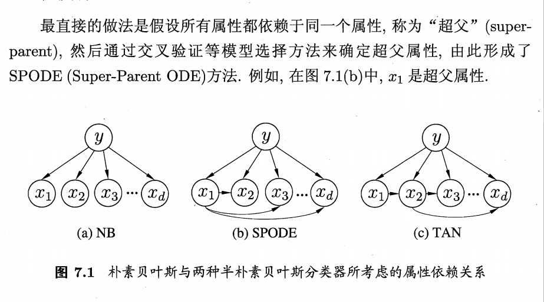

# 第7部分：贝叶斯分类
##半朴素贝叶斯分类器
朴素贝叶斯采用了属性条件独立分布假设，但是在现实中这个假设很难成立。于是人们尝试对属性条件独立假设进行一定的方式，因此产生了“半朴素贝叶斯”学习方法。
半朴素贝叶斯分类器基本思想是考虑部分属性之间的依赖关系。“独依赖估计”（one dependent estimator简称oem）是半朴素贝叶斯常用策略。所谓独以来指每个属性在类别之外最多依赖于一个其他属性。
$$
P(c|x)=P(c) \prod_{i=1}^dP(x_i |c,pa_i)
$$
其中$pa_i$为属性x所依赖的属性，称为$x_i$的父属性。此时，对于每个属性$x_i$,如果其父属性$pa_i$已知， 则就可以估计概率值$P(x_i |c,pa_i)$,于是问题就转换为如何求得每个属性的父属性。

### TAN
TAN值在最大带权生成树算法的基础上，通过一下步骤将依赖关系简约为c图。
1. 计算任意两个属性时间的条件互信
$$
I(x_i，x_j |y) = \sum_{x_i,x_j;c \in y}p(x_i,x_j|c)log{ {p(x_i,x_j|c)} \over{p(x_i|c)p(x_j|c)}}
$$
2. 以属性为节点构成完全图，任意两个节点之间的权重设为$I(x_i，x_j |y) $;
3. 构建次完全图的最大带权生成树，挑选跟变量，将边设置为有向；
4. 加入类别节点y增加从y到每个属性的有向边。
* 条件互信刻画了属性$x_i;y_i$在已知类别下的相关性，因此最大生成树算法TAN实际保留了强相关属性之间的依赖。
##贝叶斯网
贝叶斯网也叫“信念网”，他利用有向无环图（DAG）来刻画属性之间依赖关系，并使用条件概率表来描述属性联合概率分布。
具体来说一个贝叶斯网B由结果G和参数$\Theta$组成：
$$

$$
B =\left\langle G,\Theta  \right\rangle
$$
网络G是有向无环图，每个节点对应一个属性，如果两个属性之间有依赖关系，则用边链接起来；参数$\Theta$描述这种定量依赖关系，假设属性$x_i$在G中父节点集为 $\pi_i$ ,则$\Theta$包含每个属性的条件概率表示为：
$$
\theta_{xi|\pi_i}=P_B(xi|\pi_i)
$$
