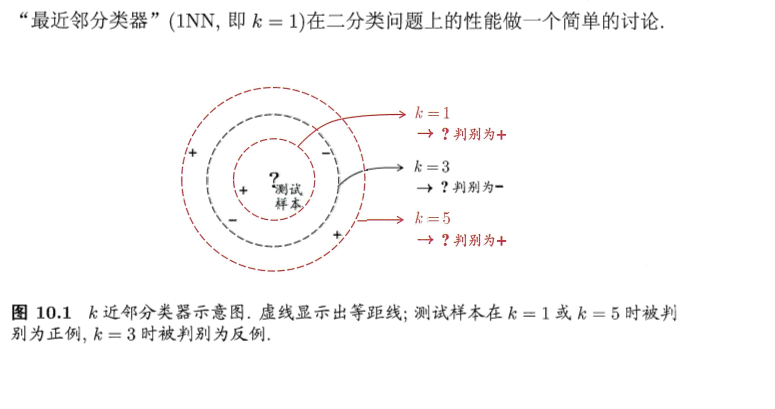
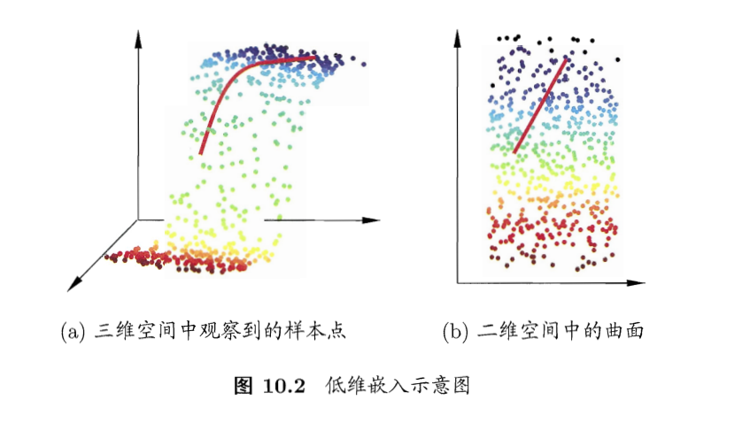
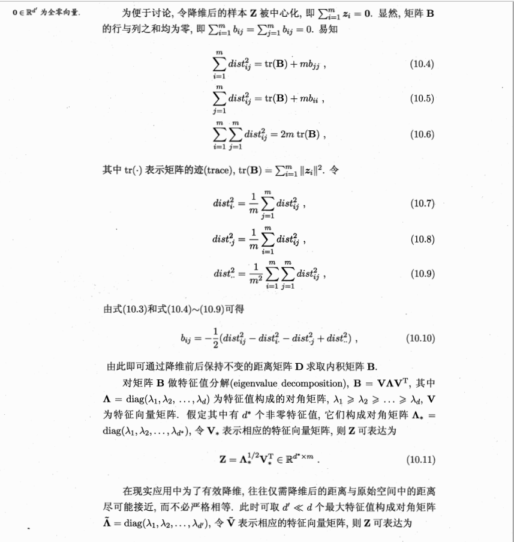
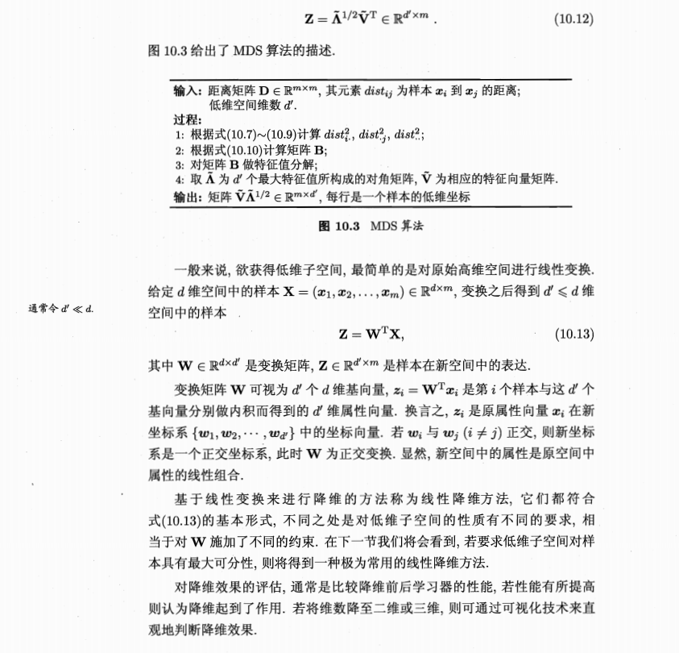

# 第10部分：降维和度量学习
## k邻近学习
k邻近学习是一种常用的监督学习方法，其工作机制简单：给定测试样本，基于某种距离度量找出训练集中与其最靠近的k个训练样本，然后基于这k个“邻居”的信息来预测。通常在分类任务中可采样“投票法”，即将这k个样本中出现最多的类别标记作为预测结果；在回归任务中可用“平均法”，即将k个样本的实际输出标记的平均值作为预测结果；还可基于距离的远近进行加权平均或加权投票，距离越近的样本权重越大。
显然k邻近算法中k是一个重要参数，当k取值不同是分类结果也不同；另一方面如果采样不同的距离计算公式，则找出的“近邻”可能有显著差别，从而导致分类结果显著不同。

给定测试样本x，如果其最邻近样本为z，则最邻近分类器出错的概率是x和z类别标记不同的概率：
$$
P(error)=1- \sum_{c \in y}P(c | x)P(z | x)
$$

假设样本独立分布，且对于任意样本x和最小正整数$\sigma$,在x的附近$\sigma$距离范围内总能找到一个训练样本；换言之，对任意测试样本，总能在任意近的范围内找到训练样本z。
令$c^*=argmax_{c \in y} P(c | x)$表示贝叶斯最优分类器结果，则：
$$
P(error)=1- \sum_{c \in y}P(c | x)P(z | x)\approx 1- \sum_{c \in y}P(c | x)^2 \leq 1- P(c^* | x)^2 = (1- P(c^* | x))(1+ P(c^* | x)) \leq 2(1- P(c^* | x))
$$
于是我们惊讶的发现最邻近算法分类器虽然简单，单是他的泛化错误能力不超过贝叶斯最优分类器的错误率2倍。
## 降维
* 在k最邻近分类器中，假设$\sigma =0.001$,考虑单个属性，则仅仅需要1000个样本分布在归一化后的属性取值范围内，因此他的泛化错误能力不超过贝叶斯最优分类器的错误率2倍。但是如果属性是20 维则 样本个数至少需要$(10^3)^{200}=10^{60}$个样本才能满足在任意样本x附近任意小的$\sigma =0.001$距离范围内总能找到一个训练样本。这个数据对样本的要求来说是个天文数字，此外许多学习方法都设计到距离的计算，但是高维度空间会给距离的计算带来很大的困难，在维度很大是甚至计算内积都很麻烦。
* 在高维条件下样本稀疏，距离计算困难等问题在机器学习算法中称为“维数灾难”。
* 缓解上面问题的方法称为“降维”，即通过数学变化将原始高维属性空间转变为低维子空间，在这个子空间中样本密度大幅度提高，距离计算更容易。

如果要求原始空间样本之间的距离在低维空间得到保持，则需要用到“多维缩放（Multiple Dimensional Scaling）”，简称MDS。
假定m个样本在原始空间距离矩阵为$D \in R^{m * m}$,其中第i行第j列元素$dist_{ij}$为样本$x_i 到x_j$的距离，我们的目标是获取$d^,$维空间的表示 $Z \in R ^{d^,*m}, d^,< d$,且任意两个样本在$d^,$维度空间的欧氏距离等于原始空间距离，即 $|| z_i - z_j|| = dist_{ij}$ 
令：$B=Z^TZ \in R^{m*m}$,其中$B$为降维后的样本内积距离，$b_{ij}=z_i^Tz_j$,有
$$
dist_{ij}^2=|| z_i|^2+|| z_j|^2 - 2z_i^Tz_j = b_{ii}+b_{jj}-2b_{ij}
$$

229/442
